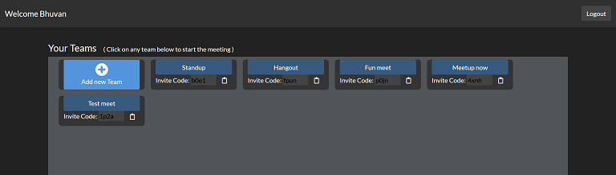
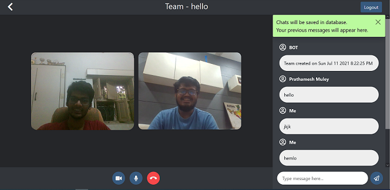

# Teams-io
This is a video calling and chatting app.
This is a microsoft teams clone app built under Microsoft Engage Mentorship 2021. \
In this app, you can add create and join teams. \
Your existing teams would be displayed on your dashboard. \
To join the meeting just click on any team. 

## Demo
Try out this app on https://teams-io.herokuapp.com  \
Full video tutorial can be found on https://www.youtube.com/watch?v=we74w-oneNk 

## Features
* Includes authentication by login/register
* Group video call for multiple people
* Chats are saved in database are not lost on logging out

### Usage
First clone the repository from Github.
Install project dependencies:
    
    $ npm install
  
You can now run the development server:

    $ npm run dev
    
You can access the default local server at http://127.0.0.1:5000/